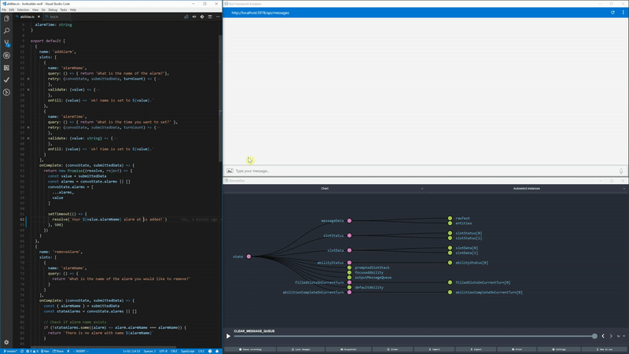

# Wolf Core [](https://badge.fury.io/js/wolf-core) [](https://travis-ci.org/wolf-packs/wolf-core)

Wolf allows you, the developer, to define the bot conversation with ease. There is one configuration point, which is hot-loadable, enabling you to change the bot behavior while the node process is still running. 

Wolf facilitates information gathering, either by asking a question or accepting a piece of information parsed by NLP.  The library is also an abstraction layer that ensures stability, which means if the Botbuilder SDKv4 interface changes, the bot behavior can stay the same.

_Please see [Roadmap](https://github.com/wolf-packs/wolf-core/wiki/Roadmap) for more details and planned features. If you do not see a feature, please feel free to open an issue._

**Wolf Core will be framework agnostic in v3, making it easy to integrate with backend services like express, bot framework, dialogflow, etc.**  
For now, wolf v2 is coupled with Microsoft Bot Builder v4.

___

## Guiding Principles:
* **Functional:** Wolf stages are pure functions.  Side-effects are allowed but is defined and managed by you, the user.
* **Stateless:** Wolf stages are stateless meaning that the data is passed in on every function invocation, making hot-swappable possible, and testing extremely easy.
* **Declaritive:** You specify **what** you want (abilities and slots), and **what** to do after you have the information. Wolf will figure out **how** to get the information and complete the ability for you.

___

## Purpose
Developing intelligent chatbots often lead to complex dialog trees which results in prompting the user for many pieces of information. Most frameworks require you to keep track of the state yourself as well as hard-coding static dialog flows to gather these pieces of information. Development often turns into creating a complex state machine where you must check the current state to determine which prompt the chatbot should issue next.

Wolf aims to provide a highly flexible and convenient framework for enabling state driven dynamic prompt flow. Simply define all the `slots` to be filled (information required from the user, prompts to issue, and actions to take after the information is fulfilled) and Wolf will handle the rest to ensure all information is collected. `Slot` can be defined as dependencies on other `slots` if desired. A collection of `slots` are grouped by `abilities` which also can have dependencies on another to help drive dynamic conversation flow.

All functions from `wolf-core` are pure functions.



AlarmBot demo with hot-loading abilities and Redux DevTools to visualize bot state in development.

___

## Bring Your Own Natural Language Processing.. BYONLP
This library takes the guesswork out of complex conversation flows, and allows you to declaritively define your slots.  However, it does not parse user intent or entities for you.  Wolf takes in the result of NLP (which can be as simple as regex or as complex as a tensorflow-backed model), and determines the next slot or ability to complete.

In order for Wolf to accept your NLP, the result to follow a specific object shape. This shape is typed as `NlpResult`, and it is as follows:
```js
{
  intent: string,
  entities: [
    {
      value: any,     // normalized value
      text: string,   // raw value
      name: string    // entity name (should match slot name)
    }    
  ]  
}
```
_Please note: NLP entity name should match slot name for Wolf to detect matches!_
___

## Ability Structure
__*Slot*__: A slot is structure that represents any piece of information that is required from the user and obtained through conversation or a system. This can be the user's name, address, etc.. A slot structure has a few properties which allows Wolf to dynamically search for possible matches. Anatomy of a slot:
- `name`: name of slot. **should match an entity name from your NLP**
- `order`: optimal order to fill slot. (ascending order)
- `query`: string to prompt user to obtain information.
- `validate`: function to test if the information is valid before fulfilling.
- `retry`: string(s) to prompt user if validator does not pass.
- `onFill`: function that returns string to present to user on slot fulfill.

Here is an example of a slot from the alarm example:
```js
name: 'alarmName',
query: () => { return 'What is the name of the alarm?'},
retry: (turnCount) => {
  // array of retry phrases to send to user
  const phrase = ['Please try a new name (attempt: 2)', 'Try harder.. (attempt: 3)']
  if (turnCount > phrase.length - 1) {
    return phrase[phrase.length - 1]
  }
  return phrase[turnCount]
},
validate: (value) => {
  // validator that must pass before slot is fulfilled
  if (value.toLowerCase() === 'wolf') {
    return { valid: false, reason: `${value} can not be used.`}
  }
  return { valid: true, reason: null }
},
onFill: (value) => `ok! name is set to ${value}.`
```

__*Ability*__: An ability is a logical unit that contains a collection of slots and runs a function when the slots are filled.  An ability also has other features like kicking off another ability once it is completed

- `name`: name of the ability **should match an intent name from your NLP**
- `slots`: collection of Slots
- `nextAbility?`: a function that specifies the next ability to kick off and a message to let the user know.
- `onComplete`: function (sync or asynchronous) that runs upon all slots being filled.

Here is an example of an ability from the alarm example:
```js
name: 'addAlarm',
    slots: [
      // .. see `alarmName` slot example above
    ],
    onComplete: (convoState, submittedData) => {
      return new Promise((resolve, reject) => {
        const value = submittedData
        const alarms = convoState.alarms || []
        // add alarm to convoState
        convoState.alarms = [
          ...alarms,
          value          
        ]                                             
        
        // demonstrate async supported
        setTimeout(() => {
          resolve(`Your ${value.alarmName} alarm is added!`)
        }, 2000)
      })
    }
```

___
## Install
Open a pre-existing Microsft Bot Framework v4 project directory and run:
```
npm install wolf-core
```

## How to Use
1. Install `wolf-core`.
2. Import Wolf into a pre-existing Microsft Bot Framework v4 bot.
```js
import { wolfMiddleware, getMessages, createWolfStore, IncomingSlotData } from 'wolf-core'
```

3. Create an abilities definition 
(see example [alarmBot abilities](https://github.com/wolf-packs/wolf-core/blob/master/examples/alarmBot/abilities.ts))
4. Import the abilities definition
```js
import abilities from './abilities'
```

3. Setup the Wolf middleware
```js
// Wolf middleware
adapter.use(...wolfMiddleware(
  conversationState,
  (context) => nlp(context.activity.text),
  (context) => abilities,
  'listAbility',
  createWolfStore()
))
```

4. Handle the output messages in the `server.post`
```js
server.post('/api/messages', (req, res) => {
  adapter.processActivity(req, res, async (context) => {
    try {
      if (context.activity.type !== 'message') {
        return
      }
      const messages = getMessages(context) // retrieve output messages from Wolf
      await context.sendActivities(messages.messageActivityArray) // send messages to user
    } catch (err) {
      console.error(err.stack)
    }
  })
})
```
___

## Setup Redux Dev Tools
1. Have a pre-existing v4 bot running with Wolf (see above)
2. Setup the dev tool server
```js
/**
 * Starting dev tools server
 */
const remotedev = require('remotedev-server')
const { composeWithDevTools } = require('remote-redux-devtools')
remotedev({ hostname: 'localhost', port: 8100 })
const composeEnhancers = composeWithDevTools({ realtime: true, port: 8100, latency: 0 })
```
3. Edit the fifth argument (createWolfStore) for the `wolfMiddleware`
```js
// Wolf middleware
adapter.use(...wolfMiddleware(
  conversationState,
  (context) => nlp(context.activity.text),
  () => {
    delete require.cache[require.resolve('./abilities')]
    const abilities = require('./abilities')
    return abilities.default ? abilities.default : abilities
  },
  'listAbility',
  createWolfStore([], composeEnhancers) // replace createWolfStore()
))
```
4. Download [Redux DevTools](https://chrome.google.com/webstore/detail/redux-devtools/lmhkpmbekcpmknklioeibfkpmmfibljd) from the Chrome store.
5. In the Chrome browser, click on the DevTools icon (top right) > 'Open Remote DevTools'
6. Settings (bottom right) > tick 'Use custom (local) server' and fill in information > Submit
```
Host name: localhost, Port: 8100  // port edefined in step 2
```
7. To view the state in a chart display, change 'Inspector' dropdown to 'Chart' option
8. Run the bot and the websocket server should start with chart visuals.

_Note: See alarmBot example with Redux Dev Tools enabled._

___
## Testing

Testing a bot has never been easier with
[Wolf-Rive](https://github.com/wolf-packs/wolf-rive) testing package. Any Wolf enabled v4 bot has the ability to utilize this testing package which allows users to write end-to-end testing of input and output conversation flows.

All example bots have their own `/tests` which utilize `wolf-rive` package. Please refer to [examples](https://github.com/wolf-packs/wolf-core/tree/master/examples) and [Wolf-Rive](https://github.com/wolf-packs/wolf-rive) for full testing details.

___
## Resources

See [Wolf Core Concepts](https://github.com/wolf-packs/wolf-core/wiki/Core-Concepts) for more information about middleware usage.

See [examples](https://github.com/wolf-packs/wolf-core/tree/master/examples) for full implementation.
* [simpleBot](https://github.com/wolf-packs/wolf-core/blob/master/examples/simpleBot/bot.ts) - Basic example.
* [alarmBot](https://github.com/wolf-packs/wolf-core/blob/master/examples/alarmBot/bot.ts) - Redux DevTools and hot-loading.
* [profileBot](https://github.com/wolf-packs/wolf-core/blob/master/examples/profileBot/bot.ts) - More complex example. SlotData push model, setting up api endpoint to accept slotdata by conversationId.

___
## Contribution
Please refer to [Wolf Wiki](https://github.com/wolf-packs/wolf-core/wiki) for roadmap and contribution information.
